# 前言  
  
你是否想过搭建一个属于自己的个人博客呢？本篇文章我将教你如何从零开始，通过Vercel平台部署一个基于Astro框架的个人博客。  
  
# 介绍  
  
***Astro-theme-Mizuki*** 是一个基于***Astro***的现代化静态博客模板，具有丰富的功能和美观的设计。详情可以查看它的[官方文档](https://docs.mizuki.mysqil.com/)。你可以根据官方文档的教程或本文的教程进行部署。  

# 准备工作  
  
一个人，一台电脑，以及足够的耐心（稍微有点折腾）。后续内容中所用到的平台需要自行创建账号。  
  
# 下载并设置你的博客  
  
## 第一步：fork 项目到本地  
  
打开Mizuki的[Github仓库](https://github.com/LyraVoid/Mizuki)，点击***fork***并确定。  
  
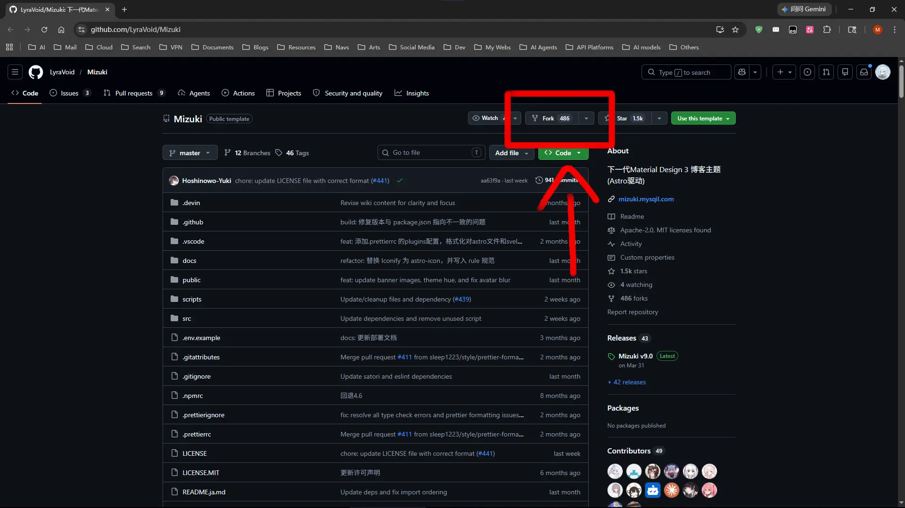  
  
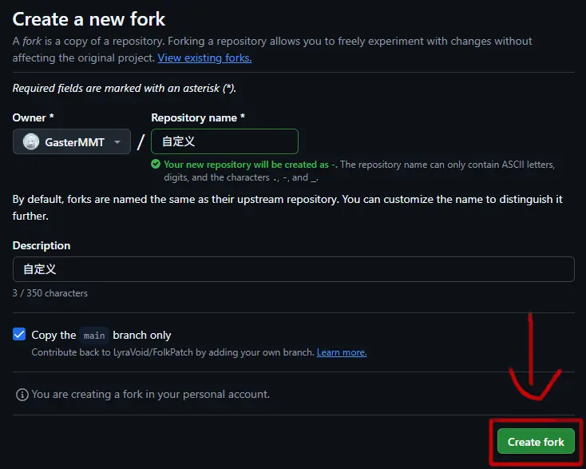  
  
下载[***Github Desktop***](https://desktop.github.com/download/)。登录后点击左上角***File***，***Clone Repository***，找到你自己的项目，设置好路径后点击***Clone***。  
  
## 第二步：修改配置文件  
  
打开项目本地的路径，你可以看到很多文件，我们主要修改的内容都在`scr\config.ts`中。你可以使用***VS Code***等编译器或者记事本打开此文件，并根据其中的注释进行配置文件的修改。想要更具体的博客设置可以参考Mizuki的[官方文档](https://docs.mizuki.mysqil.com/Basic-Layout/site-config/)。  
  
## 第三步：使用Obsidian开始写文章  
  
将主题自带的文章内容删除（删除`scr\content\posts`中的所有文件)。  
  
你可以在`scr\content\posts`路径下编写你的Markdown文章，我建议使用***Obsidian***软件进行文章编写。（[什么是Markdown](https://markdown.com.cn/intro.html) [Markdown教程](https://markdown.com.cn/basic-syntax/) [Obsidian官网](https://obsidian.md/zh/)）  
  
下载完Obsidian后打开，点击左下角***管理仓库***，在弹出的页面点击***打开本地仓库***，路径选择你的项目文章路径。（`...\scr\content\posts`)  
  
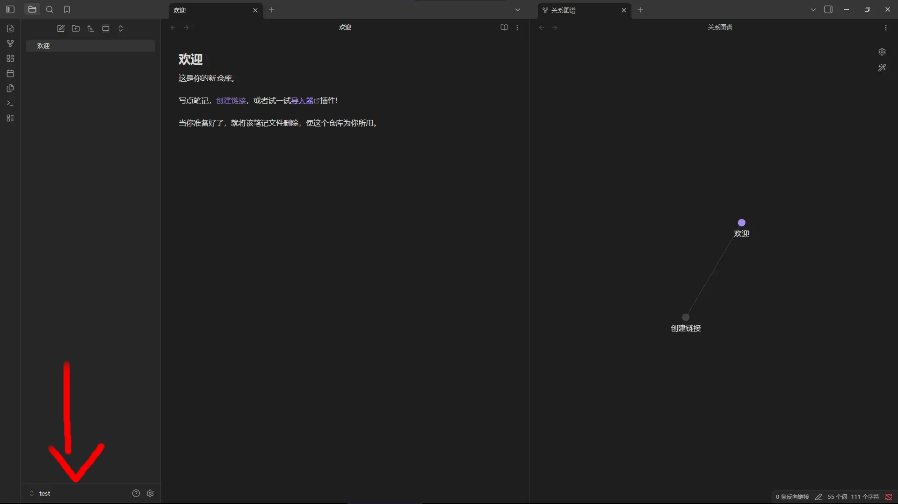  
  
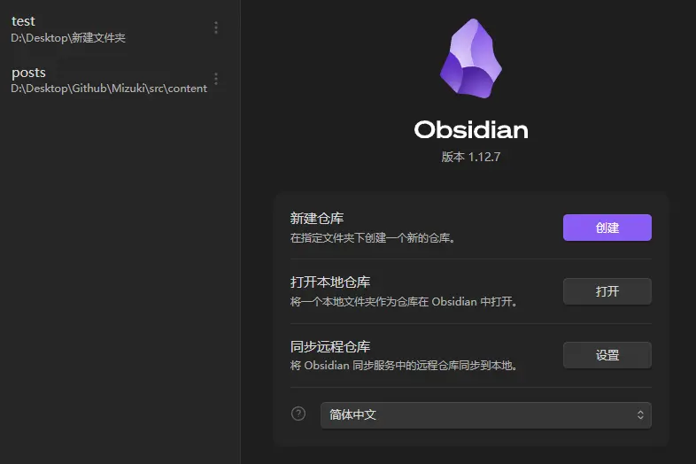  
  
设置好仓库后还需进行一些配置。打开Obsidian的设置，找到***文件与链接***，设置成如图所示。  
  
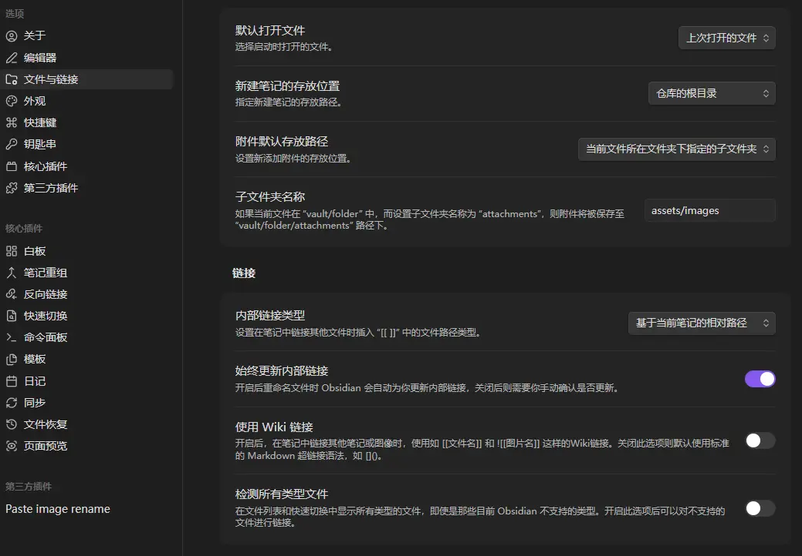  
  
这样做的目的是将Obsidian的图片链接设置成标准的Markdown语法，使得后续能够正常地在网站中显示。之后，你便可以开始使用Obsidian编写文章。  
  
需要注意的是，你的每一篇文章都需要添加***frontmatter***（前置元数据）。你可以通过Obsidian右上角的菜单中设置。  
  
点击Obsidian右上角的菜单，在弹出的选项卡中找到***增加笔记属性***。其中，***Title***和***Description***为必须内容，其余可以自行选择添加。下图为示例：  
  
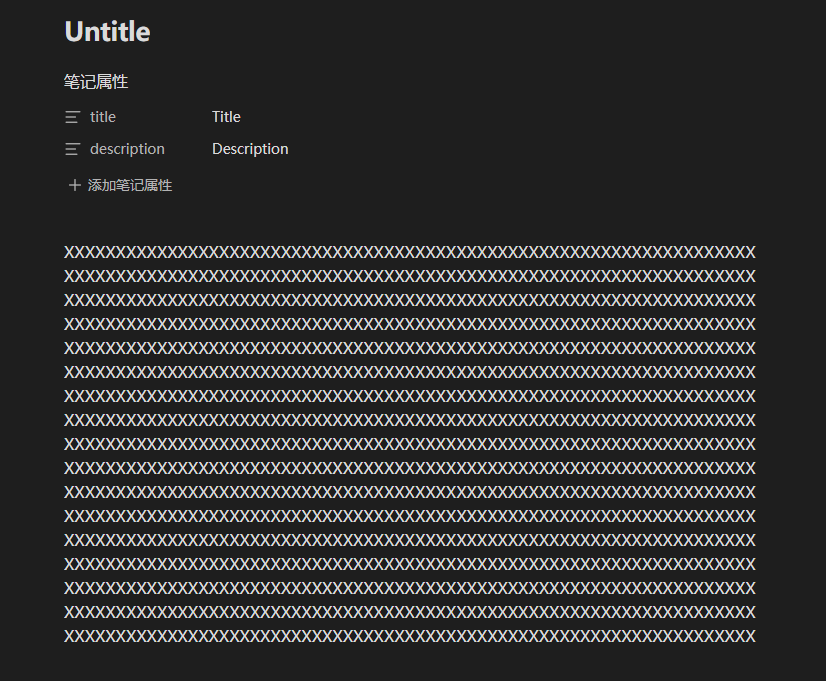
  
至此，你完成了博客的设置。  
  
# 上传并部署  
  
打开Github Desktop，在左下角的栏目里填写好信息后点击***Commit***，随后点击界面中的***Push origin***。下图为示例：  
  
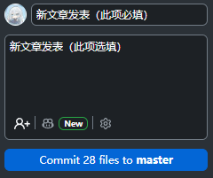  
  
打开[Vercel](https://vercel.com/)并使用Github登录（若使用其他方式登录还需额外连接Github）。登录后点击右上角的***Add New***，在弹出的选项卡中选择***Project***。在新页面中选择你的GitHub项目并点击***Import***，之后在新弹出的选项中点击***Deploy***。  
  
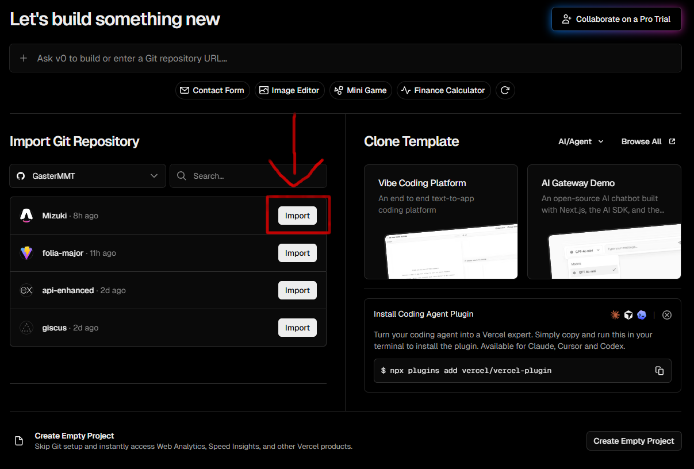  
  
等待部署完成后回到vercel主页，打开你刚才成功部署的项目。在新打开的项目页面里你可以看到一个以`.vercel.app`结尾的网址，通过该网址就可以访问你的博客啦！！！  
  
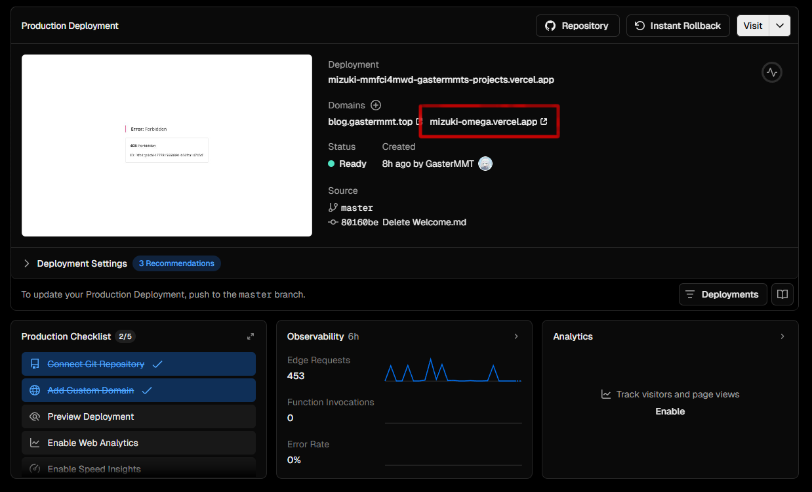  
  
# 添加自定义域名  
  
Vercel自动生成的域名在国内网络环境下几乎无法直接访问，你可以通过Cloudflare的Workers反向代理原来的域名，或者添加自己的域名来进行访问。这里我会讲如何如何添加自己的自定义域名。  
  
## 第一步：注册一个域名  
  
你可以通过各大主流平台注册域名。  
国内平台：[腾讯云](https://buy.cloud.tencent.com/domain/)，[阿里云](https://wanwang.aliyun.com/domain)，[雨云](https://www.rainyun.com/domain)，[西部数码](https://www.west.cn/services/domain/)，[宝塔](https://www.bt.cn/new/domain-register.html)等。  
国外平台：[Cloudflare](https://domains.cloudflare.com/)，[Spaceship](https://www.spaceship.com/zh/)，[namecheap](https://www.namecheap.com/domains/domain-name-search/)， [GoDaddy](https://www.godaddy.com/en/offers/domain)等。
  
***注意：***
+ 国内平台注册域名都需要实名认证，且可以备案，而国外平台注册域名无需实名，但无法备案。
+ 注册域名时你可以根据自己的喜好选择顶级域（TLD），许多主流的顶级域首年价格与续费价格相差巨大，购买时要注意域名的后续续费价格！！！  
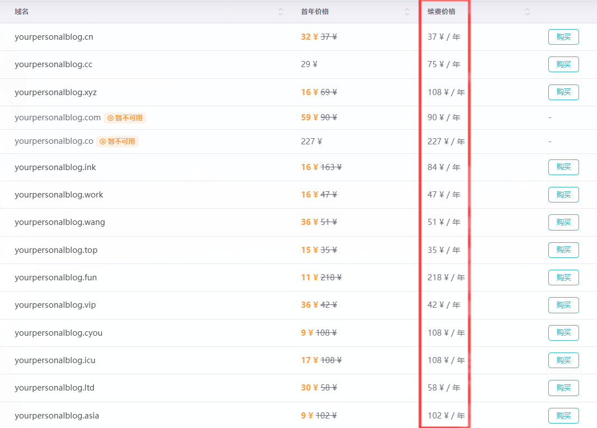  
  
具体流程：  
  
我这里以雨云举例，大部分平台操作基本相同。我选择雨云的原因主要是因为如腾讯、阿里等平台都需要实名年满18岁才能够进行注册，并且注册价格相对溢价较高，而雨云只需16岁以上即可注册，并且价格相对便宜。  
  
首先打开雨云官网，注册并登录后进入仪表盘，点击***域名服务***。在新弹出的面板中选择***域名注册***，根据相应提示填写好***所有人信息模板***后即可注册。（模板需要一段时间进行审核，请耐心等待，你可以在左侧的***我的模板***查看审核进度）  
  
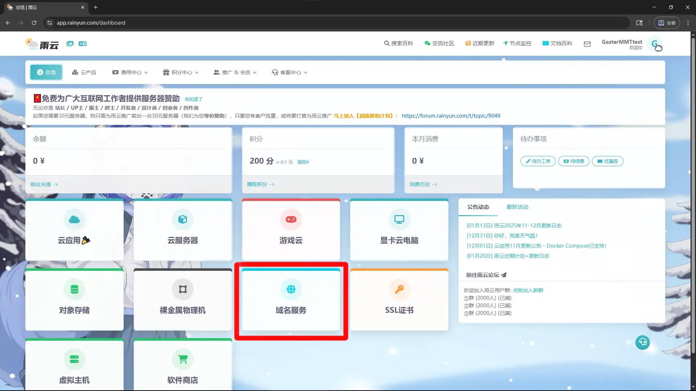  
  
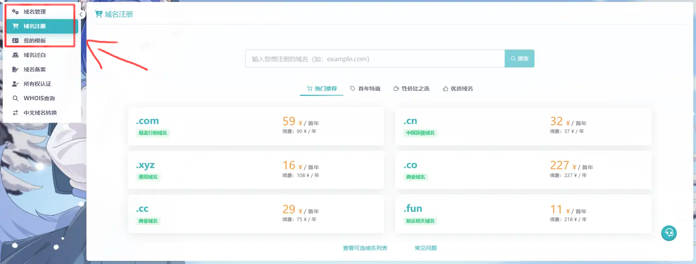  
  
## 第二步：添加域名  
  
在等待的过程中，可以先设置DNS解析。点击左侧栏目中的***域名管理***，在右侧进入***管理***或***设置DNS解析***。进入后点击***添加解析记录***，选择自定义解析。解析类型选择`CNAME`，主机名称填写你想要的网站前缀，如`www`，`blog`，等等。例如我的网站是`blog.gastermmt.top`，此处填写的就是`blog`。若你不想要前缀，可以填写`@`，（不推荐）后续访问直接输入根域名即可。记录值需要填写从Vercel上获取，后续会讲到，可以先随意填写内容，其余默认即可。  
  
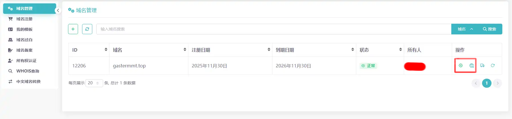  
  
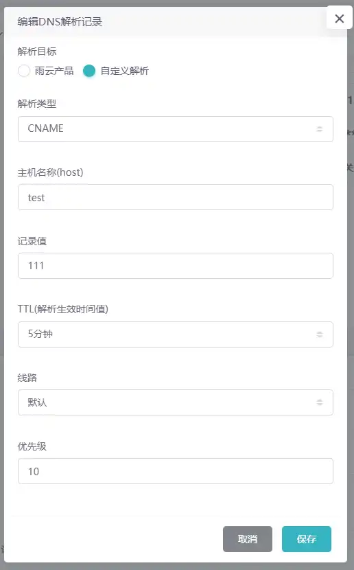  
  
回到你的Vercel的项目界面，点击左侧栏目中的***Domains***，在新打开的界面中点击右上角的***Add Existing***，将你的域名输入进去后点击***Save***。接下来你会看到报错，这是正常情况，点击***Learn more***，你会看到一个`Value`值，将他复制并粘贴至刚才的DNS解析中的记录值。  
  
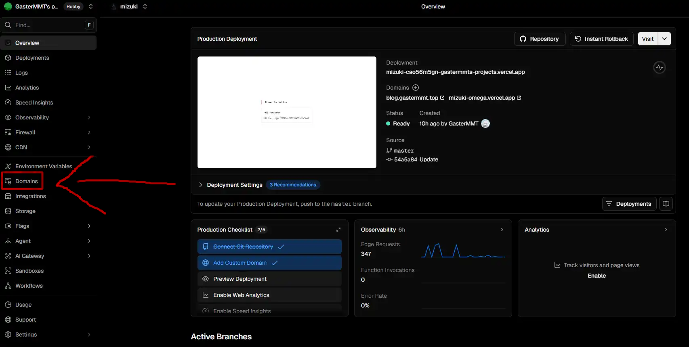  
  
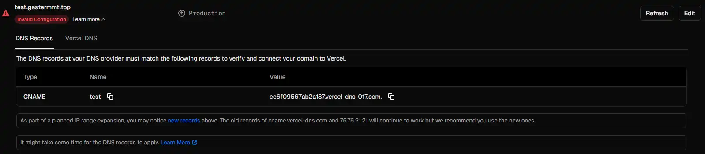  
  
重新设置好DNS解析后，稍微等待几分钟，然后回到Vercel的Domains界面，点击***Refresh***，若无报错，你就成功添加了你的自定义域名，通过该域名即可访问你的网站啦！！！